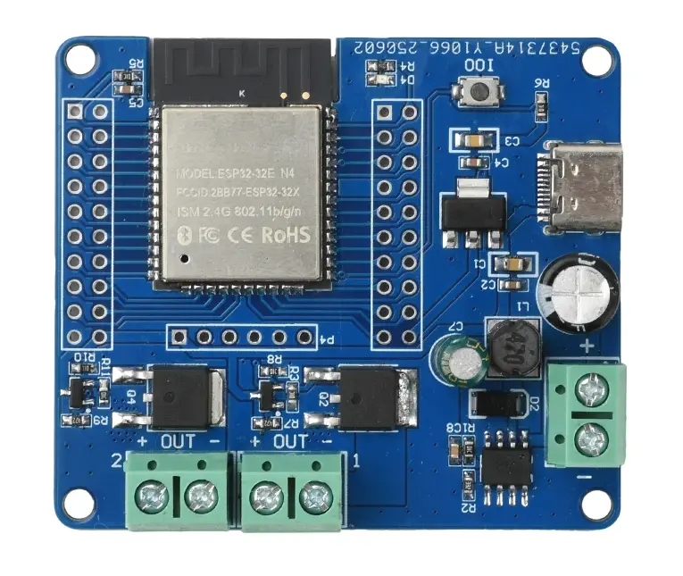
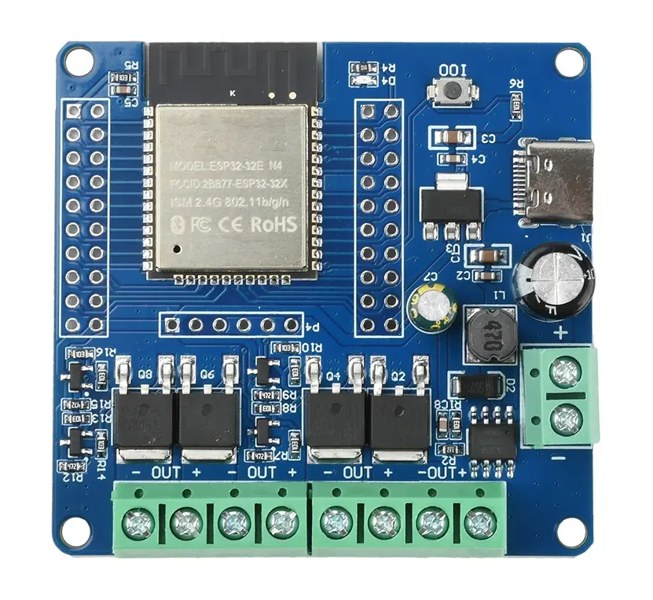
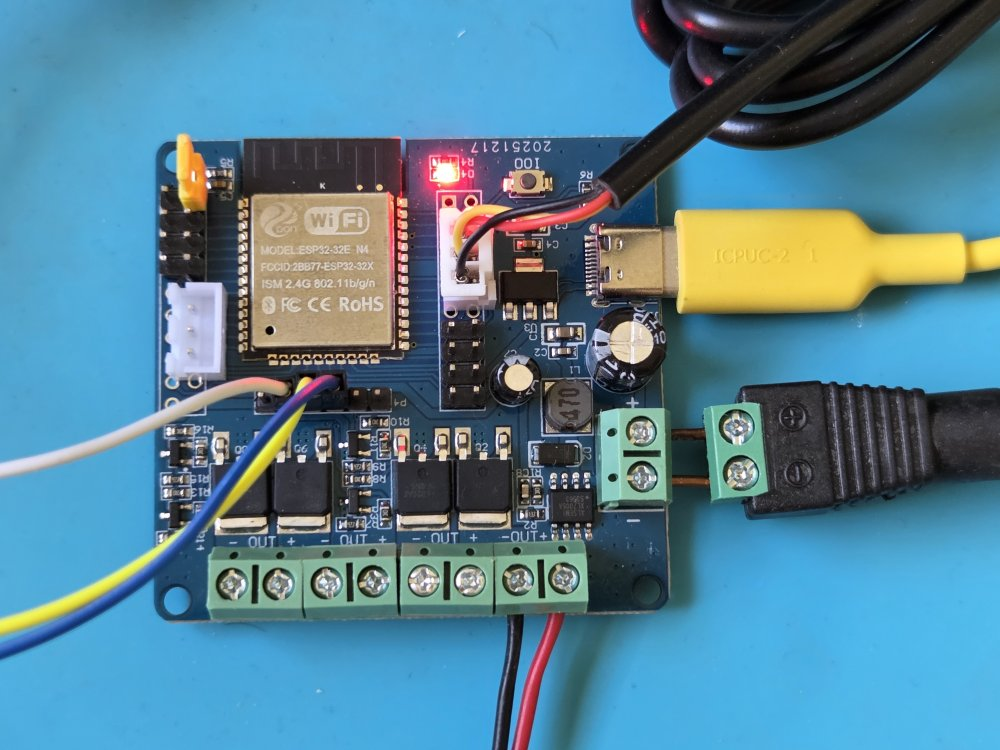
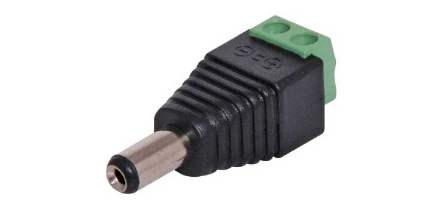
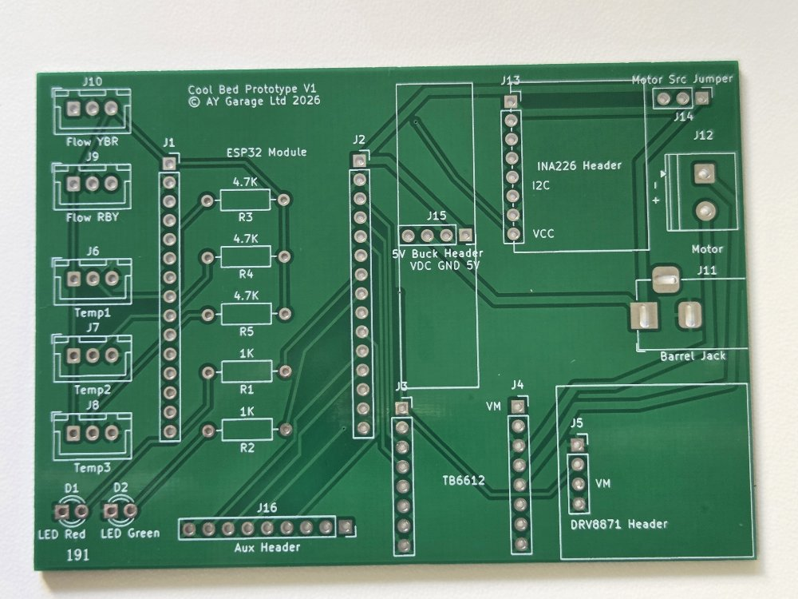
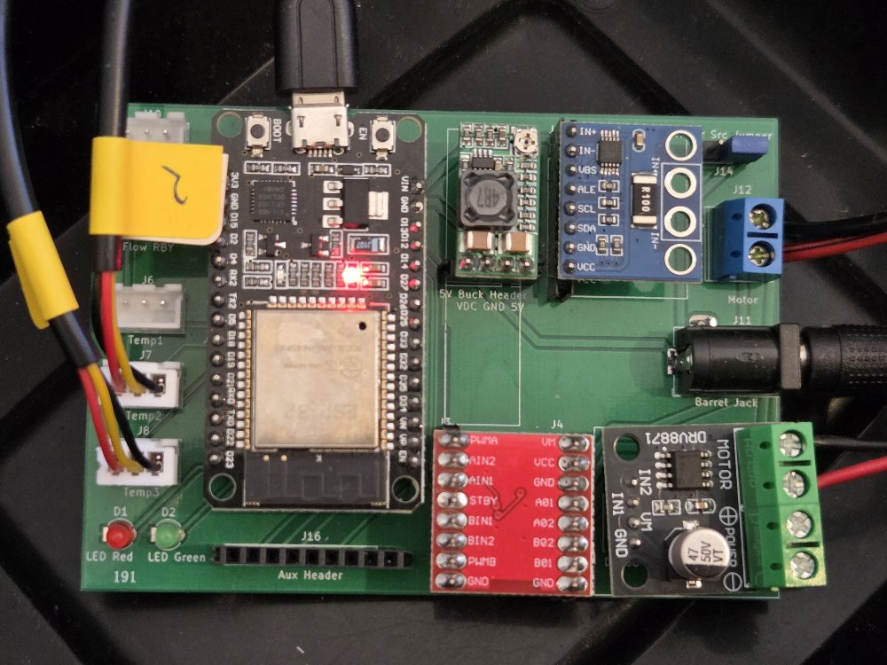

The controller ties all the components of the Cool Bed system together.
The controller consists of a printed circuit board (PCB) and its components and is typically in an [enclosure](controller-enclosure.md).

The controller will:

* Receive power from a [PSU](power-supply.md).
* Receive input from sensors, such as [temperature sensors](temperature-sensors.md), flow meter, etc.
* Control [pumps](pumps.md).
* Allow you to configure and control the system over WiFi.

The Cool Bed Firmware works with any controller board that has an ESP32 microcontroller, the required input connectors and the required outputs.

To drive the pumps and optionally the heater, MOSFET outputs are preferred. A MOSFET is a type of transistor. In theory you could use relays but then:

* a relay will make a "click" sound when activated or deactivated which can be annoying when trying to sleep, and
* MOSFETs allow us to control output power using pulse-width modulation (PWM) which the relay will not do

MOSFET outputs are not part of a typical ESP32 development board so we have several options:

* Use a board that is less common but close to what we need. Modify it to fit our use case.
* Use a popular board and add external MOSFETs.
* Design a custom board.

Aliexpress has an ESP32 board with 2 or 4 MOSFETs which we can use with modifications.
Taking a basic ESP32 dev board and extending it is not recommended and can result in "module spaghetti".
Designing a custom board can be an interesting task but requires electronics design experience.

If you know of commercial off-the-shelf (COTS) ESP32 boards that are a good fit for a Cool Bed controller with little modifications, please [suggest](../index.md#contributing) and they will be added.

For now there is only one option that is easier than building a board from several individual modules or low-level components.

## ESP32 development board with 2/4 MOSFETs

This is a development board sold on Aliexpress and made in China. It is not designed specifically for the Cool Bed but it has several elements on a single board that makes it a good fit for this use case.

Advantages:

* Has 2 or 4 MOSFETs and can drive 2-4 outputs.
* Has a DC-DC converter to convert the incoming DC supply voltage (what the [PSU](power-supply.md) provides) to the 5V and 3.3V required by the ESP32.

Issues:

* No current measurement on the outputs.
* No USB to serial chip on board. Must connect an external adapter to flash the board.
* Missing the required resistors on the USB-C power input (not compliant with the USB-C specification).
* Outputs are ON by default.

If you are going to use a heater, get the 4 MOSFET version, otherwise a 2-output version will be enough to drive the two pumps of the basic build.

### Modifications

While you can strip wires and connect them directly to the screw terminals, it is preferred to use connectors. A connector will make sure you can't swap polarity by mistake and will allow easy disconnection.

#### Connectors for temperature sensors

If your temperature sensors come with a 2.54 mm-spaced connectors, it might make sense to solder such connectors to the PCB. This will work for JST-XH connectors as well as for plain headers.
For connectors with a specific orientation, like JST, verify how the pins are arranged on the temperature sensor. The red wire is 3.3V, the yellow wire is data and the black wire is ground.
For connectors without a specific orientation, like plain headers, make sure to always connect your sensors correctly or you might destroy them due to reverse polarity.

WIP, TODO, add pins

#### Pull-ups for temperature sensors

WIP

TODO, add photo of the back

#### Connectors for pumps and power supply.

It is recommended to get DC plugs and jacks with screw terminals and join them, "back-to-back", using short pieces of solid-core copper wire to the board's terminals. This way you can disconnect the pumps when needed.

See the photo above for an example of how it is done for the DC input terminal.

#### Change default output state (optional)

This board has pull-up resistors on the GPIOs of the output. As a result, when the GPIOs are configured as inputs (as they are at the beginning) the outputs will turn on.
This is not preferred. We only want the pumps, etc to run only in response to an explicit command and not during resets, boots or malfunctions.
There is no recommended way to change this for now. If you have a good method please [suggest](../index.md#contributing).

## Example of a custom board

## Future availability of controllers made for Cool Bed 

If you are interested in an assembled Cool Bed controller, please [contact us](https://aygarage.com/contact-us/) and we will try to help.
If there is enough interest we will manufacture a small batch of Cool Bed-ready controllers that require no assembly.
