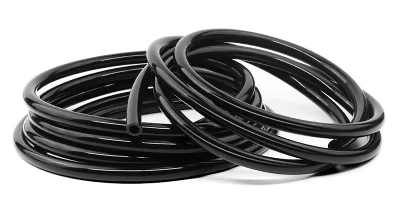
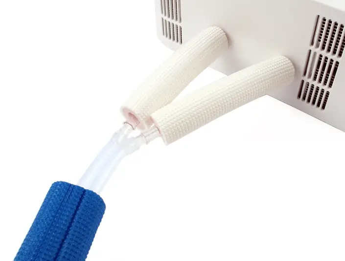

The hoses transfer [coolant](coolant.md) between components of the system.

You should use silicone hoses with an inner diameter (ID) that stretches well on other components of the loop such as [pumps](pumps.md), [mattress pad](mattress-pad.md) and [heat exchanger](heat-exchanger.md).

A good, flexible silicone hose with an inner diameter (ID) of 5 mm/0.19 in will fit other components with an outer diameter (OD) of 6 mm/0.23 in to 8 mm/0.32 in.
The hose should have a difference of about 3 mm/0.1 in between its ID and OD. That means a 1.5 mm/0.05 in thick hose wall.

Use an opaque hose because it will prevent the water from being exposed to light. This helps reduce algae growth in the loop.

For a Cool Bed system positioned next to a bed, you will need

* 2 pieces of 1-1.5 m / 40-60 in hose for the circulation loop
* 2 pieces of 0.7-1 m / 28-40 in hose for the cooling loop

If you want to place the unit farther from your bed then you will need longer hoses.

It is not recommended to use PVC tubing because it is rigid and transparent.

## Insulation

This is not mandatory at first, but later it might be beneficial to add insulation around the hoses.

More research is needed. Please [share your suggestions](../index.md#contributing).
