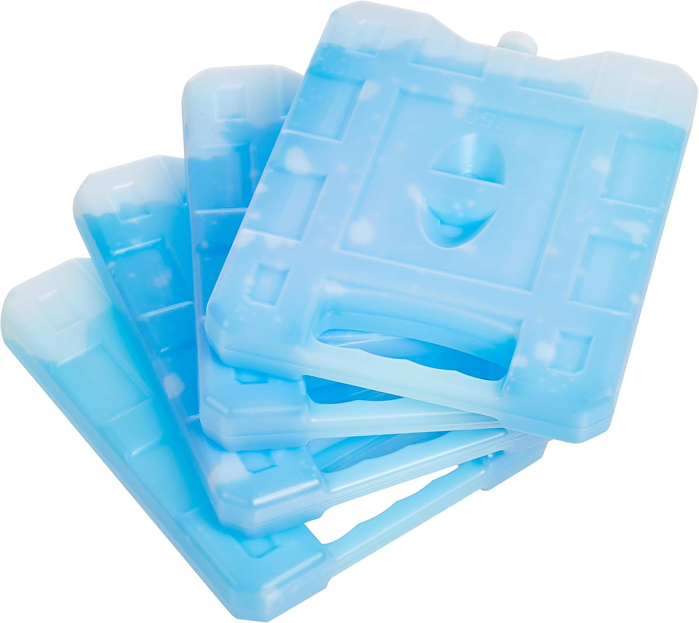

The ice packs indirectly remove heat from your body to keep you cool. They act as a reservoir of "cooling capacity".
The Cool Bed system has no active cooling and requires frozen ice packs to cool you.

Keep several ice packs handy. They should be small enough to fit in the [cooling container](containers.md#cooling-container) of your choice.

Make sure the outer material of the ice pack doesn't degrade when submerged in water and that the internal material is sealed.
Gel-filled packs absorb heat more slowly and will spread the "cooling capacity" over more time. A container filled with frozen water stores more "cooling capacity" than gel but releases it more quickly. Experiment with different options to achieve the cooling duration you need.

Packs that are "self-absorbing" are not recommended because they are supplied dry and take water from the container. As a result their contents may not be fully sealed from the coolant in your loop.

Add more or fewer ice packs depending on what you need and can fit. Check the temperature of the coolant in the cooling container at the end of each use to decide if you need to adjust the number of ice packs. Optionally log the temperatures over time using the [MQTT integration](../assembly/mqtt.md) and Home Assistant.

Clean and [disinfect](coolant.md/#disinfection) the ice packs regularly.
