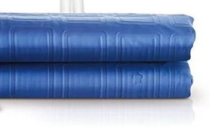
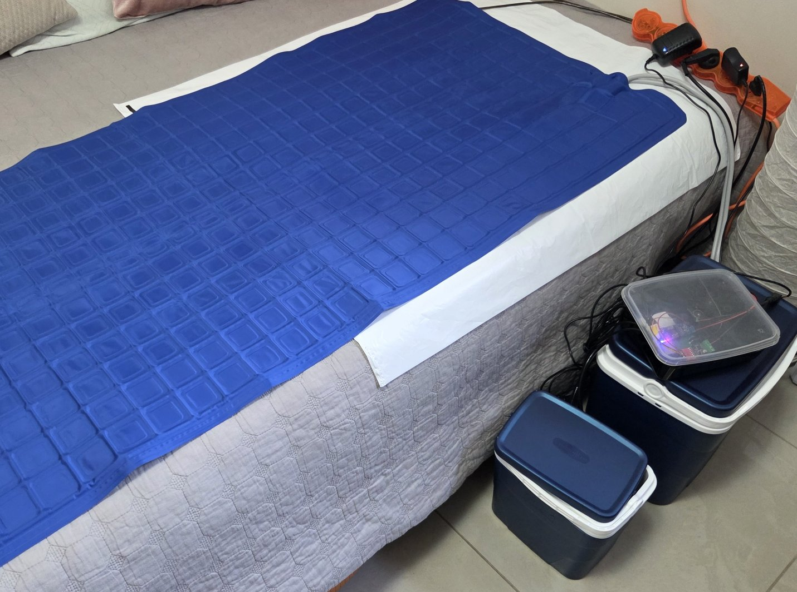

The mattress pad is one of the main components of the Cool Bed system. This is the part that you put on top of your mattress. The pad has two hose connections. Inside the pad, there are water channels that go all the way around the pad running from one hose connection to the other. The water can flow in either direction.

Place your fitted sheet over the pad. If you have a mattress protector then you can put it either under or over the pad.

If the pad feels too cold you can cover the pad with a blanket to reduce heat transfer.

The simplest mattress pad is made of PVC. Two layers are bonded together in a pattern that forms water channels. Pads are available in single and double sizes.
Pads are usually sold in gray or blue color and have a pattern of squares on them.
Such pads are usually sold on Aliexpress as part of a Chinese-made evaporative cooling device. Many listings allow you to order just the pad.

An advantage of the PVC pad is that it provides excellent heat transfer. Mattress pads that are made with foam or fabric will have lower heat transfer. This means you don't need to cool as much with the PVC pad to feel cool. A disadvantage of the PVC pad is that it is more rigid.

If you are going to use a double pad, consider a more powerful circulation pump.

Some pads come with straps that you use to tie the pad to the mattress. Otherwise the pad can move around and bunch up which is not optimal. More research is needed to determine how to source a pad with straps or how to attach DIY straps to a pad or how to secure the pad to a mattress.

Mattress Cooler USA sells Replacement Cooling Pads that have straps.
