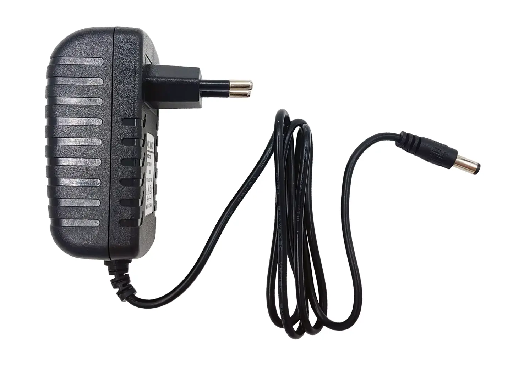

The power supply converts mains voltage to the DC voltage required by the [controller](controller-board.md), [pumps](pumps.md) and other components.

Keep in mind that each component has a maximum rated voltage. Exceeding it can damage the component.

Typically, this system uses either 9 V or 12 V, and the PSU must match the selected system voltage.

If you are making a custom build you can choose any system voltage that suits your design. It is not recommended to exceed 40 V for safety reasons.
Choose a PSU with a connector that matches the controller, or use an adapter.

It is recommended to get a good quality PSU which is standards compliant. This helps ensure proper isolation between the mains and the low-voltage DC side.

Also make sure the PSU matches the mains socket type and mains voltage used in your country.
