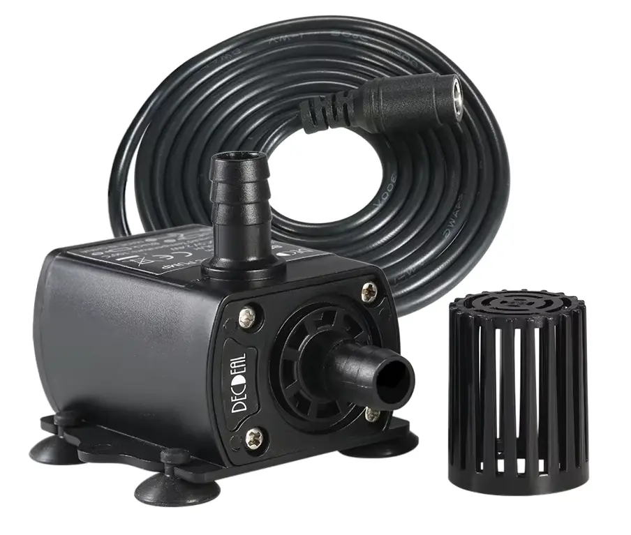
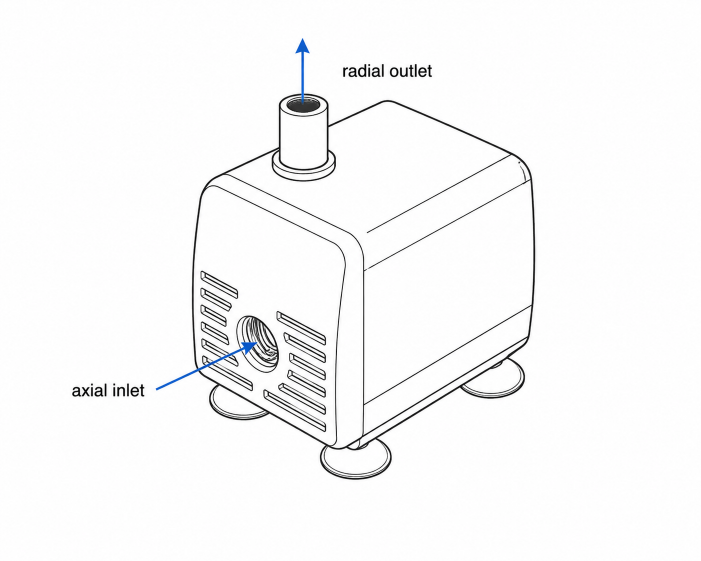

The Cool Bed system uses pumps to move water through the two loops of the system.
The simple build uses two small submersible pumps, often sold as mini aquarium pumps.
A submersible pump is generally quieter because it operates underwater, and the water dampens noise and vibration.
You don't necessarily need to use a submersible pump but it is simpler for a DIY build. With a different mechanical design, you can place the pump outside the container instead.

Pump example:

## Voltage

For safety, it is strongly recommended **not** to use mains powered pumps in this use case.

The system voltage of your Cool Bed will depend on the output voltage of the [Power supply unit](power-supply.md) that you will use. Typical system voltages are 9 V or 12 V.
Your pumps need to operate at that voltage.

Many pumps have a voltage range. You can operate a pump at a lower voltage within its specified operating range. For example, running a 6-12 V pump at 9 V.

## Pump power

There is a trade-off here. A more powerful pump will be noisier. A less powerful pump might not be able to remove all the air from the loop.
We are looking for the perfect pump. Please [provide suggestions and your feedback](../index.md#contributing).

The circulation loop has much higher flow resistance due to the narrow channels in the pad while the cooling loop is practically not obstructed. As a result, the circulation pump needs to be more powerful.
Current recommendation is about 5-6 W for circulation and 3-4 W for cooling.
Note that many pumps claim certain power ratings but in practice deliver less power, sometimes as much as half of what is listed. Always evaluate the actual performance.

## Power connector

Common types of power connectors include a DC barrel jack and a USB A plug. The DC barrel connector is generally the more practical choice.

You need to match the connector to the output connector on the [controller](controller-board.md).
If the controller has a screw terminal, then it is a valid option to cut the connector and screw the wires in. Just make sure not to reverse the polarity.

It is recommended to get DC plugs with screw terminals and use some solid-core copper wire to connect them to the board's terminals. This way you can disconnect the pumps easily when needed.

## Water connector

Only the outlet of the pump needs to be connected to a hose. The outlet is the radial port.

The return hose just goes to the container. Position the end of the return hose at the opposite end of the container. This makes it hard for air exiting the system to be sucked right back into the loop. This also creates a better flow and heat exchange.

Position the pump in the container so that the inlet faces upward. This way it is easier for any trapped air to exit the pump and the loop.
If the pump has a protector/filter on the inlet, remove it or it will prevent air from escaping.

A common outer diameter (OD) of the hose connector is 8 mm/0.32 in. A good flexible silicone hose will fit over it, even if the inner diameter (ID) of the hose is 5 mm/0.19 in.
If your pump has a different size connector, plan your hoses and adapters accordingly to create a functional loop.
