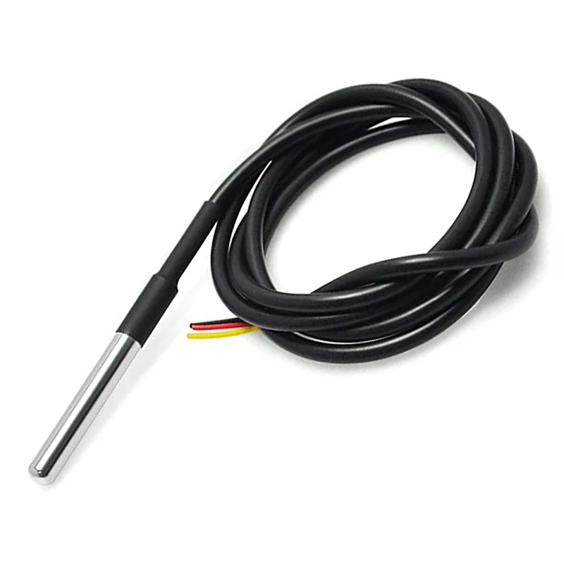
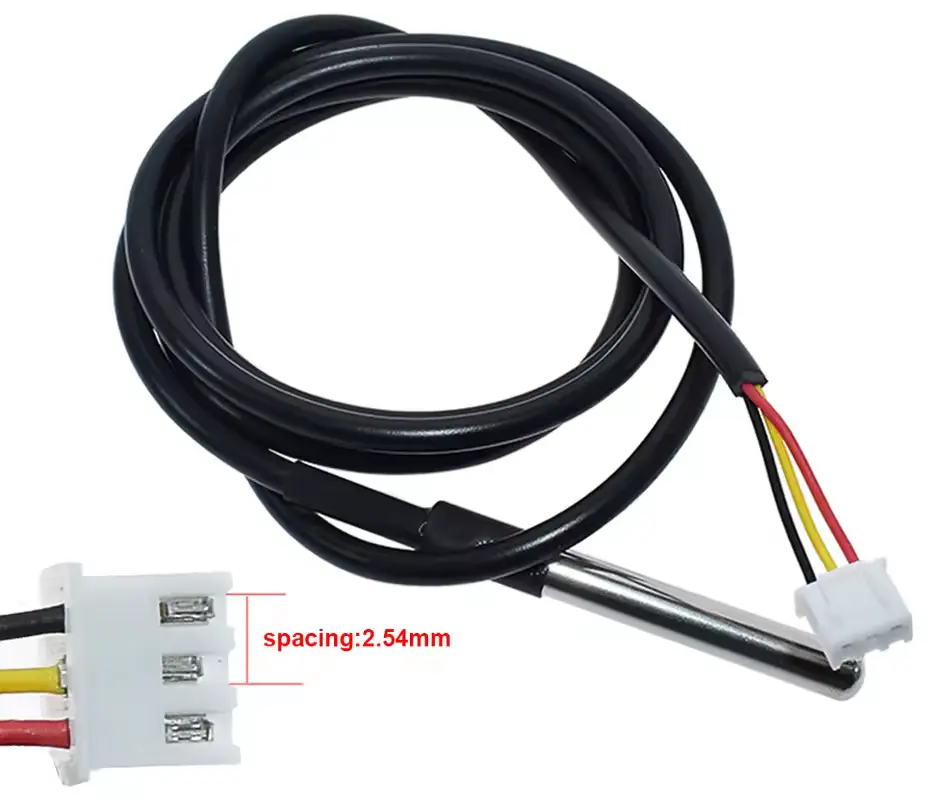

Temperature sensors provide the controller with temperature readings from different parts of the system. This allows the controller to make the appropriate control decisions.

The supported temperature sensor type is DS18B20, originally designed by Dallas Semiconductor. This is a digital sensor and it uses a communication protocol called 1-Wire.
This kind of sensor works well with the ESP32. The DS18B20 itself is a 3-pin integrated circuit (IC).

We can't use it as-is to measure water temperature because it is not waterproof and would short-circuit and corrode.

For this project, we want the waterproof version, where the IC is sealed inside a stainless steel probe. This version can be submerged in water.

## Connector

It is recommended to get one with a JST-XH 3-pin connector. This way you can replace or reconnect the sensors easily. You will need a matching connector on your [board](controller-board.md), though. The JST has a specific orientation, so it is hard to mess up the polarity.

If you prefer, you can also get a sensor with no connector and just solder the cable to your board.

## Temperature sensors in Cool Bed

A typical build uses two temperature sensors, but custom builds may use one or three.

### Outgoing temperature sensor

This sensor measures the temperature in the circulation container. This is the temperature of the coolant that flows to the mattress pad.
This sensor is mandatory. Without it the system will not work.

### Cooling temperature sensor

This sensor measures the temperature in the cooling container. This temperature indicates how much cooling capacity remains. It is useful to know and track this so you can configure your system correctly.
This sensor is recommended but not mandatory.

### Return temperature sensor

This sensor measures the temperature on the water returning from the pad. Together with the outgoing temperature sensor this can tell us how much heat was transferred from the user.
This is designed for research and advanced users. Most builds will not include this sensor.
