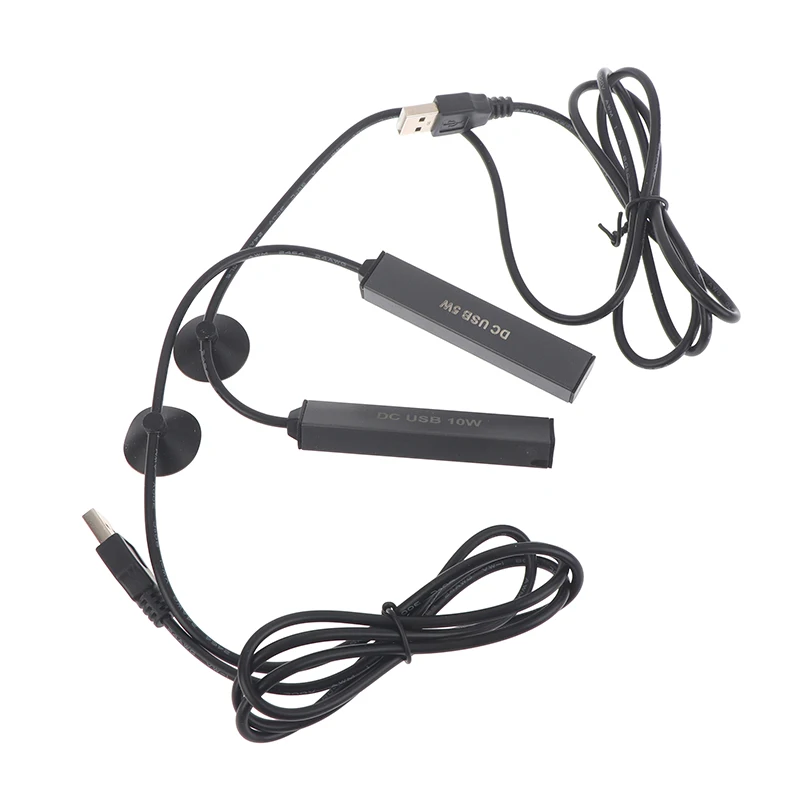

The water heater heats the coolant in the circulation loop, either for use during the winter or when the circulation coolant's temperature is below the desired set point.

Simple 5 W and 10 W USB aquarium heaters are available. They appear to be simple resistive heaters.
These are unlikely to raise the water temperature by more than 5–10 °C.
They are well suited for maintaining a target temperature or for preheating water from room temperature to a comfortable temperature.

If the heater is purely resistive, it can be operated above its nominal voltage (for example, 9 V instead of 5 V) to increase its power output, although this increases the risk of failure.
You must measure the current and ensure that the power supply and controller can provide the required current.
The higher the power, the more likely the heater is to burn out. More experiments are needed.
Ensure that the heater remains well below the water level during operation.
