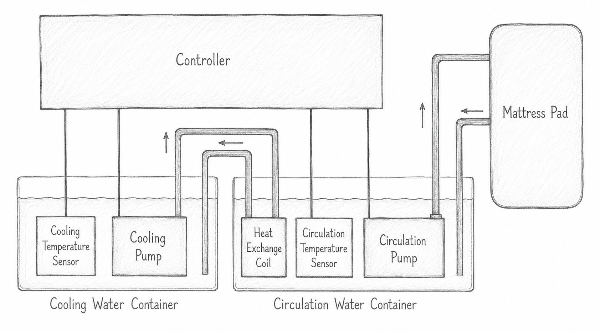

You can build a Cool Bed device in many different ways. There are several [different options](builds.md). This is the basic diagram:

To build it, get the following components:

Component | Suggested beginner part | Search terms | Approximate cost | Notes
------------ | ------------- | ------------ | ----------: | ---------
[Mattress pad](components/mattress-pad.md) | PVC Water Circulation Mattress Pad | water circulation bed ice sleeping pad | 35 USD | See listings for evaporative water cooling devices, can get just the pad there. Connector OD should be ~7mm/0.27in .
[Circulation pump](components/pumps.md) | Submersible pump 9V/12V ~6W | quiet mini aquarium submersible water pump | 7 USD | 8mm/0.32in OD of outlet, open inlet. If getting a 12V model, look for higher-power version.
[Cooling pump](components/pumps.md) | Submersible pump 9V ~3-4W | quiet mini aquarium submersible water pump | 6 USD | 8mm/0.32in OD of outlet, open inlet
[Power supply](components/power-supply.md) | Mains to 9V PSU, 2A | dc 9v power adapter | 5 USD | Prefer a good quality one. Match for mains voltage and socket in your country.
[Hoses](components/hoses.md) | Opaque silicone hose, ~5M/16ft length, ID 5mm/0.19in, OD 8mm/0.32in | silicone tube rubber hose | 8 USD | A 5mm ID hose should stretch over an 8mm pump outlet, 7mm pad connectors and a 6mm copper tube.
[Containers](components/containers.md) | Two coolers, each between ~4 and 12 liters/quarts | cooler box camping icebox | 40 USD | Can use something ad hoc at first and upgrade later. Sets will be less expensive than buying individually.
[Ice packs](components/ice-packs.md) | 1-2 small ice packs | portable ice packs freeze | 5 USD | Preferably flexible ones made of plastic.
[Coolant](components/coolant.md) | ~4-5 liters/quarts or 1 gallon of distilled water | distilled water | 2 USD | Can be collected for free from a dehumidifier, dryer, or air conditioner. Otherwise home improvement or auto stores should have this at gallon quantities.
[Coolant disinfectant](components/coolant.md#disinfection) | Benzalkonium chloride (BZK)–based disinfectant | laundry fabric sanitizer disinfectant | 5 USD | Can be a spray or a bottle. Just check sanitizers at a supermarket or pharmacy for products that contain Benzalkonium chloride as an ingredient. Note the concentration.
[Controller board](components/controller-board.md) | ESP32 development board with 2/4 MOSFETs | ESP32 board MOSFET MOS switch | 6 USD | Get the 4-output version if you are planning to add a heating function later, otherwise 2 outputs are enough.
[Controller enclosure](components/controller-enclosure.md) | any box, electrical junction box, lunch box or enclosure that you like | plastic box enclosure abs junction | 4 USD | You can use something ad hoc at first and upgrade later. You can 3d print something with a more custom fit.
[Temperature sensors](components/temperature-sensors.md) | 2 DS18B20 temperature sensors with 1M cable | stainless steel waterproof ds18b20 temperature sensor probe | 2 USD | Match the connector to how you are going to connect it to the controller. Usually with a 2.54 mm plug or just wires.
[Heat exchanger](components/heat-exchanger.md) | 30cm or 12 inch of copper tube ID 4mm/0.15in OD 6mm/0.23in | copper tube coil airs conditioner refrigeration cooling | 7 USD | Usually sold at a length of 1m. Cut it to the required length with a saw and bend it into a shape that fits. Don't use cutters, as they will deform the tube.

Extras: connectors for the temperature sensors, DC barrel connectors, and 4.7 kΩ resistors for pull-ups. TODO, expand this section.
