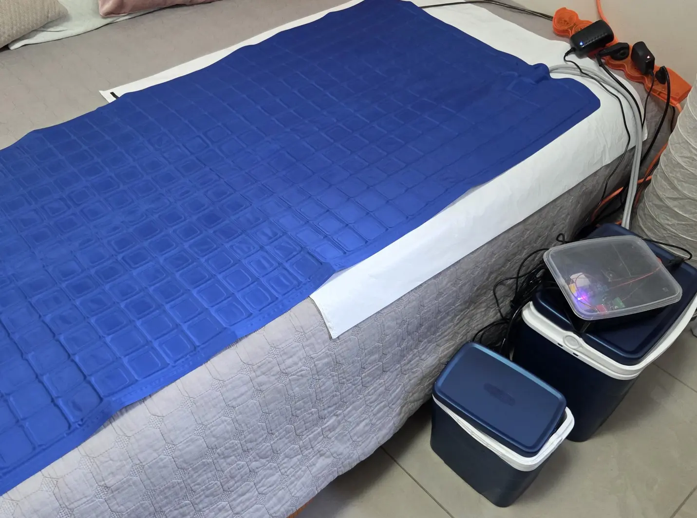

A technical guide and community resource for building the **AYG Cool Bed**, an open-source DIY mattress cooling system.

The Cool Bed is a simple, inexpensive, open-source water-based bed cooling system that uses frozen ice packs instead of active refrigeration. 

**The advantages of Cool Bed are**

* Runs entirely locally — no subscriptions, cloud accounts, or vendor lock-in.
* Fanless operation — quiet, with no heatsinks or fans collecting dust.
* Temperature-controlled — maintains a comfortable water temperature instead of simply circulating cold water.
* Uses frozen ice packs — simple, inexpensive, and energy-efficient.
* Environmentally friendly — low energy usage compared to an AC.
* No evaporative cooling — doesn’t increase room humidity or expose the coolant to room air.
* Built from readily available components — inexpensive, repairable, and easy to modify.
* Closed-loop water system — minimizes contamination from dust and dirt.
* Built-in Wi-Fi — no proprietary hub required.
* Multiple control options — use the built-in web interface, Home Assistant, or MQTT.

---

For additional project information and resources, visit: [AYG Cool Bed](https://aygarage.com/cool-bed/)

## Contributing

If you'd like to contribute, please share your suggestions, corrections, and findings in the project's [Discussions](https://github.com/ayavilevich/cool-bed-wiki/discussions).

